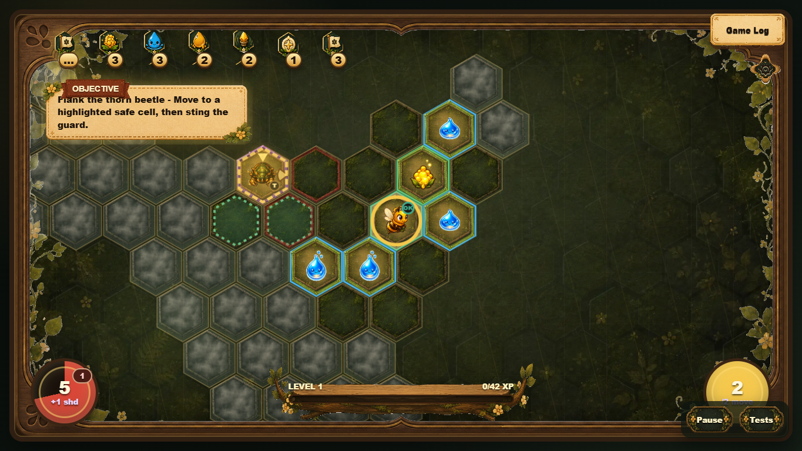
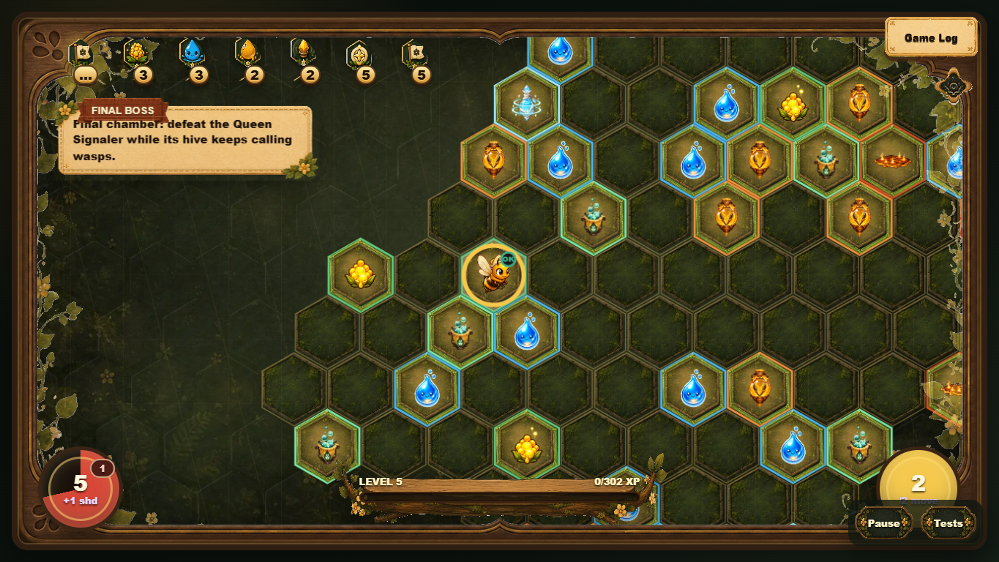
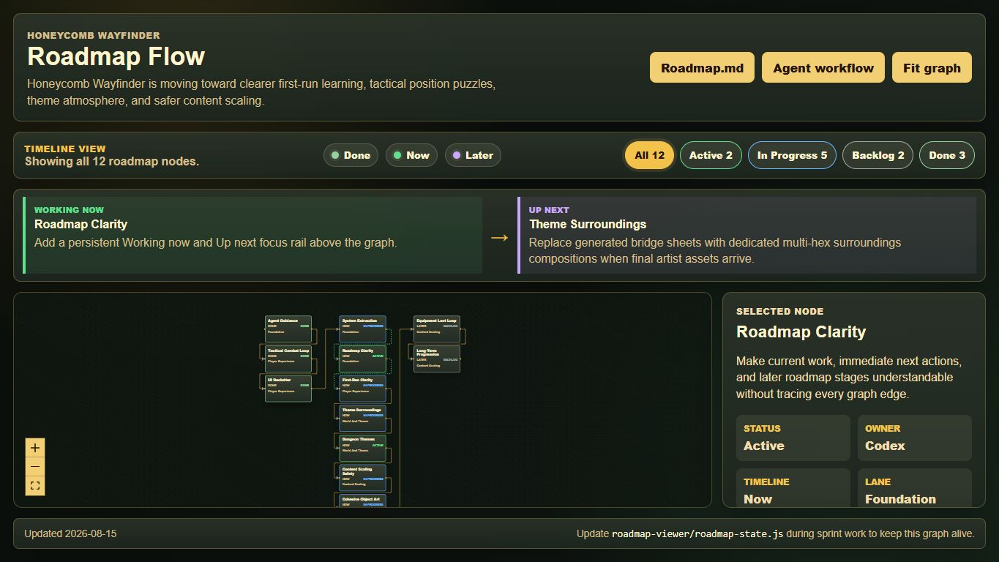

# Honeycomb Wayfinder: Core Extraction and Adaptation Methodology

Current implementation snapshot, extraction method, and practical handbook for turning the game into a reusable tactical hex-game platform.

Snapshot: `development` at commit `5463146` on 2026-08-15. Roadmap-viewer work is active in the working tree and is described separately from committed gameplay behavior.

## Executive brief

Honeycomb Wayfinder is now more than a hex-grid prototype. It has a tactical turn economy, multi-cell route previews, risk prediction, seeded cave generation, data-defined objects and enemies, authored teaching rooms, replay records, localization, theme selection, and a canvas-based presentation layer.

The reusable product is not the whole game. The best extraction target is a small deterministic engine with five responsibilities:

- Hex coordinates, neighbors, distance, pathfinding, and route annotations.
- Tactical turn state: movement points, one action, action consumption, and enemy response.
- Content definitions plus registries for item effects, enemy behaviors, and cell interactions.
- Seeded dungeon topology and room-template contracts.
- A narrow adapter interface for rendering, input, audio, persistence, localization, and time.

Keep Honeycomb-specific art, copy, HUD, music, balance, and narrative outside that core. The dance subsystem is already separable enough to become an optional mode or a different project.

This document has two jobs. The opening brief explains what exists and where the reusable boundary should be. The methodology that follows explains how to extract that boundary, how to create a different game on top of it, and which tools keep content expansion safe for designers and artists.

## What the player experiences

The player guides a bee through a mist-covered axial hex dungeon. Hovering or tapping a destination previews a route, movement cost, hazards, and likely damage. The bee spends movement points to travel and one action to collect, open, attack, trade, or use a tactical object. Enemies then resolve their movement, pressure, attacks, and telegraphs.

Early rooms teach one rule at a time. The room shown below asks the player to move to a safe flank cell before stinging an armored Thorn Beetle. The objective, highlighted cells, persistent HUD, fog, and inspectable objects are different views over the same tactical state.



*Figure 1. Authored first-run combat lesson: visible objective, protected enemy, safe flank cells, fog, resources, and movement budget.*

The late-game room uses the same primitives at a larger scale. More enemies and resources are allowed, a boss objective replaces the lesson prompt, and theme/content pools change, but pathfinding and turn resolution remain the same.



*Figure 2. A themed boss room assembled from the same cell, content, objective, HUD, and tactical-turn systems.*

## Core gameplay loop

1. Generate a seeded room graph and playable hex cells.
2. Place entry, exit or boss, objective objects, supplies, hazards, and enemies.
3. Reveal cells around the bee and render the current world projection.
4. On hover or tap, calculate and memoize a path preview with movement and risk annotations.
5. On click, walk as far as the current movement budget allows and stop at interactions or blockers.
6. Consume the player action for attacks and most interactions.
7. Resolve enemy turns, hazards, delayed telegraphs, objective progress, fog, and replay events.
8. Refill movement/action state and repeat until the room, run, or boss ends.

This loop is the most important extraction seam. It can run without canvas drawing if rendering, sound, wall-clock time, and storage are injected as adapters.

## Architecture today

### Orchestration shell

`index.js` owns the live game object, input wiring, screen transitions, system construction, and many cross-system callbacks. It is the composition root, but it is still too large to be the reusable package.

### Data layer

`src/data/content.js` defines localized text, sprite metadata, objects, enemies, relics, and spawn weights. `src/data/progression.js` defines room profiles, unlock levels, and theme-specific content pools.

### Extracted systems

`src/systems/` already contains focused modules for pathfinding, tactical flow/combat, items, enemies, cell interactions, enemy turns, dungeon generation, room templates, rendering helpers, inspect data, HUD, audio, replay, equipment, rewards, market/camp, themes, and run summaries.

### Presentation adapters

The DOM and canvas UI live in `index.html`, `index.js`, and rendering/UI systems. The presentation is intentionally game-specific and should consume engine snapshots and events rather than own rules.

### Verification layer

`npm test` runs content/data checks, Lamp-style art checks, roadmap checks, browser gameplay smoke tests, and viewport layout checks. The Test page creates one focused scenario for every object, which is valuable as an engine conformance suite.

## Representative code

### 1. Memoized path and risk preview

The current pathfinding system already receives its dependencies through a context object. That is close to an extractable engine API. The cache key includes all player values that can change route validity or predicted cost.

```js
function getPathPreview(cell) {
    const game = getGame();
    if (!cell || game.mode !== 'dungeon') return null;
    const riskTick = Math.floor(performance.now() / 300);
    const key = `${game.player.q},${game.player.r}->${cell.q},${cell.r}`
        + `:${game.player.health}:${game.player.upgrades}`
        + `:${game.player.water}:${game.player.movePoints}`
        + `:${game.player.actionAvailable}:${riskTick}`;
    if (game.pathCache[key]) return game.pathCache[key];
    const preview = annotatePathRisk(findPathToCell(cell));
    game.pathCache[key] = preview;
    return preview;
}
```

Extraction change: replace `performance.now()` with an injected clock or turn revision, and replace mutation of `game.pathCache` with a cache owned by the path service.

### 2. Tactical action economy

The tactical flow module is almost pure. It creates turn state and provides explicit commands for spending movement or consuming the one action.

```js
function startTurn(player) {
    player.movePoints = player.maxMovePoints ?? startMovePoints;
    player.actionAvailable = true;
    syncLegacyStamina(player);
}

function spendMovePoints(player, amount) {
    const cost = Math.max(0, amount);
    if ((player.movePoints ?? 0) < cost) return false;
    player.movePoints -= cost;
    syncLegacyStamina(player);
    return true;
}
```

Extraction change: return new state plus domain events instead of mutating the player directly. Keep legacy stamina outside the core.

### 3. Registered cell interactions

Special cells are moving away from hardcoded branches. Rules describe the role, default action, and cursor, while handlers can be registered by object id.

```js
return {
    getInteractionRule,
    isCollectOnMoveObject,
    isFreeWalkoverObject,
    handleWalkoverObject,
    registerMoveHandler: (object, handler) => moveHandlers.set(object, handler),
    getMoveHandler: (object) => moveHandlers.get(object) || null
};
```

Extraction change: make every interaction return a standard result such as `{ state, events, stopPath, consumesAction }`. The renderer can then interpret events without being called by the rule.

### 4. Data-defined enemy behavior

The Guard Wasp combines reusable behaviors instead of owning a bespoke update loop.

```js
guardWasp: {
    hp: 2,
    attack: 2,
    range: 2,
    behavior: 'Stationary guard with forced movement.',
    behaviors: [
        { type: 'damageAura' },
        {
            type: 'pushPlayerOnAttack',
            landingObject: 'bomberMarkedCell',
            landingDelayMs: 1800,
            landingDamage: 1
        }
    ]
}
```

Extraction change: validate definitions against a schema and execute behavior records through a registry. Text, sprites, and colors belong to the game content package, not the engine definition.

## Proposed generalized core

### Package 1: hex-domain

Own axial coordinates, keys, neighbors, range, distance, direction, rings, line traversal, and coordinate conversion helpers. It must know nothing about bees, sprites, or DOM elements.

### Package 2: tactical-engine

Own immutable game state, movement/action budgets, command validation, turn phases, path interruption, damage/shield resolution, delayed effects, and domain events.

### Package 3: content-runtime

Own schemas and registries for object effects, interaction handlers, enemy behaviors, objectives, and room-template requirements. Game-specific content is supplied as data.

### Package 4: dungeon-generator

Own seeded random generation, room graphs, organic room blobs, wide corridors, connectivity checks, farthest-room selection, and entry/exit portal selection.

### Package 5: platform adapters

Define interfaces for input, clock/scheduling, random seed, persistence, localization, replay transport, audio, and rendering. The browser implementation remains in Honeycomb Wayfinder; a test adapter runs headlessly.

```ts
type GameEvent =
    | { type: 'playerMoved'; path: Hex[] }
    | { type: 'resourceChanged'; id: string; amount: number }
    | { type: 'damageApplied'; source: string; health: number; shield: number }
    | { type: 'enemyMoved'; enemyId: string; from: Hex; to: Hex }
    | { type: 'telegraphCreated'; effectId: string; cells: Hex[] };

interface TacticalCore {
    getState(): Readonly<GameState>;
    preview(command: PlayerCommand): CommandPreview;
    dispatch(command: PlayerCommand): GameEvent[];
    advanceEnemyTurn(): GameEvent[];
}
```

## Generalization methodology

Generalizing the game does not mean replacing bee nouns with generic nouns. It means identifying rules that remain true when every visual, narrative, resource, enemy, and room theme changes. The method below treats Honeycomb Wayfinder as the first client of a small game platform rather than as a template to copy wholesale.

### The four-layer test

Classify every piece of the current game into one of four layers before moving code:

1. **Mechanic:** a theme-neutral rule such as hex distance, movement budget, line of sight, damage, action consumption, or a delayed telegraph.
2. **Composition:** a reusable arrangement of mechanics such as a pursuer, an aura enemy, a locked route, a spawn timer, or a room objective.
3. **Content:** tuned data and references such as health, attack range, spawn weight, sprite key, sound cue, localized name, and unlock level.
4. **Presentation:** canvas drawing, animation, HUD layout, cursor, inspect copy, audio playback, and screen transitions.

A candidate belongs in the core only when layers 1 or 2 can be expressed without Honeycomb-specific names, assets, DOM access, or wall-clock assumptions. Layers 3 and 4 belong to a game package or host application.

Use the substitution question as a quick check: if a wasp can become a security drone while preserving the same commands, state transitions, and events, the behavior is reusable. If the rule talks about pollen, honey, a bee sprite, parchment UI, or a particular song, it is game content or presentation.

### The eight-step mechanic extraction technique

1. **Observe one complete interaction.** Record the player intent, preconditions, state changes, enemy response, feedback, replay record, and failure cases.
2. **Name the command.** Express intent as data: `moveTo`, `attackTarget`, `interact`, `useResource`, `endTurn`, or a game-specific extension command.
3. **Separate validation from execution.** A preview answers whether the command is legal, its cost, its route, and its risks. Dispatch applies the accepted command.
4. **Emit facts, not UI instructions.** Return events such as `damageApplied` or `telegraphCreated`; do not call a popup, sprite, sound, or DOM function from the rule.
5. **Move variability into definitions.** Health, range, costs, effects, target filters, timing, and behavior composition become validated content data.
6. **Inject unstable dependencies.** Randomness, time, persistence, localization, and asset loading enter through adapters.
7. **Freeze the behavior with a fixture.** Given a seed, initial state, and command list, assert the final state and ordered event list.
8. **Prove substitution.** Run the same fixture with a neutral content pack or second theme. If only ids, numbers, and presentation change, the mechanic is generalized.

### A mechanic worksheet

Use this worksheet for every rule moved out of `index.js` or converted into a data behavior:

- **Player intent:** What is the player trying to do?
- **Command:** What serializable payload represents that intent?
- **Preconditions:** Range, resource, action, target, visibility, and terrain requirements.
- **State touched:** Exact fields and collections that may change.
- **Events emitted:** Ordered facts required by UI, audio, replay, metrics, and tutorials.
- **Interruptions:** What stops a route or cancels the action?
- **Determinism inputs:** Seed, turn number, injected clock, and content version.
- **Presentation hooks:** Which event-to-animation, event-to-sound, and inspect mappings belong outside the core?
- **Fixture:** Smallest initial state and command sequence that proves the behavior.

The worksheet is deliberately stricter than a feature description. It becomes the shared contract between engine code, content definitions, tests, replay, and the future visual editor.

## Platform contract

The extracted platform should be a modular monolith, not a set of services. A single package workspace is simpler to develop, debug, version, and embed. Packages enforce boundaries without adding network or deployment complexity.

### State, commands, previews, and events

The central API has four concepts:

- **State** is serializable, versioned, and owned by the engine.
- **Commands** describe player or system intent and never contain DOM nodes or callbacks.
- **Previews** explain legality, cost, reachable path, projected damage, interruptions, and the resulting action type without mutating state.
- **Events** describe what happened in deterministic order so rendering, audio, replay, tutorials, and metrics can react independently.

```ts
type PlayerCommand =
    | { type: 'moveTo'; target: Hex }
    | { type: 'attackTarget'; targetId: EntityId }
    | { type: 'interact'; target: Hex }
    | { type: 'useAbility'; abilityId: string; target?: Hex }
    | { type: 'endTurn' };

interface CommandPreview {
    legal: boolean;
    reasonKey?: string;
    reachablePath: Hex[];
    movementCost: number;
    projectedDamage: number;
    interruptions: RouteInterruption[];
    action: 'move' | 'attack' | 'collect' | 'open' | 'trade' | 'blocked';
}

interface DispatchResult {
    state: Readonly<GameState>;
    events: GameEvent[];
}
```

The UI may request previews many times while a pointer moves. Only dispatch changes state. This distinction is what makes path highlighting, mobile selection, automated playtests, and replay agree.

### Behavior registry

Definitions should compose a small vocabulary of tested behaviors. The runtime registry maps behavior type to implementation; content authors select and configure those behaviors rather than writing update loops.

```ts
interface BehaviorHandler<TConfig> {
    validate(config: TConfig, context: ValidationContext): Diagnostic[];
    preview?(state: GameState, entity: Entity, config: TConfig): PreviewEffect[];
    resolve(state: GameState, entity: Entity, config: TConfig): GameEvent[];
}

registry.register('damageAura', damageAuraHandler);
registry.register('spawnAfterTurns', spawnAfterTurnsHandler);
registry.register('markThenDetonate', markThenDetonateHandler);
registry.register('moveTowardPlayer', moveTowardPlayerHandler);
```

New code is required only for a genuinely new mechanic. New enemies normally combine existing behaviors and tune their data. This is the main scalability rule for future content.

### Objective contract

Objectives should use the same composition model. A room objective declares completion conditions, optional gates, and progress events:

```json
{
  "id": "disable_factory",
  "completion": { "type": "defeatEntityTag", "tag": "spawner", "count": 1 },
  "gates": [
    { "type": "lockExitUntilComplete" }
  ],
  "rewards": [
    { "type": "grantResource", "resource": "scrap", "amount": 2 }
  ]
}
```

This supports Honeycomb lessons such as opening a wax door, defeating a hive, or reaching an exit, while allowing a sibling game to use the same objective handlers with different ids and language.

## Theme and game package specification

A theme is more than a palette. Treat it as an installable package with identity, art, audio, content pools, balance, progression, and presentation mappings. A complete sibling game can use several theme packs; a simple re-theme can use one.

### Required package sections

- **Manifest:** package id, semantic version, required engine version, display name keys, and dependencies.
- **Vocabulary:** resource ids, stat ids, action labels, objective names, and localization bundles.
- **Content:** objects, enemies, hazards, equipment, relics, objectives, room recipes, and progression pools.
- **Presentation:** sprites, effects, projectiles, melee effects, HUD icons, tile/surrounding art, cursors, and fallback glyphs.
- **Audio:** music states and event-to-sound mappings with volume groups.
- **Generation:** room profiles, theme pools, objective templates, boss encounters, environmental mosaics, and spawn constraints.
- **Validation:** schema version, test scenarios, expected assets, translation completeness, and deterministic fixtures.

```json
{
  "id": "clockwork-burrow",
  "version": "1.0.0",
  "engine": ">=0.1.0 <0.2.0",
  "entryTheme": "foundry",
  "locales": ["en", "es-419"],
  "modules": {
    "content": "content/index.json",
    "progression": "progression.json",
    "presentation": "presentation.json",
    "audio": "audio.json",
    "tests": "tests/manifest.json"
  }
}
```

### Theme inheritance

Prefer composition over a deep inheritance tree. A theme can reference shared defaults and override a shallow set of tokens or pools:

- shared core mechanics and behavior handlers;
- shared host UI components and accessibility rules;
- game-family defaults for movement, inspect layout, and content schemas;
- theme-specific art, audio, colors, content pools, room recipes, and bosses.

Do not let themes override engine internals. If a theme needs a new rule, add a versioned behavior handler with tests, then reference it from data. This keeps themes portable and prevents invisible forks.

### Asset contract

Every visual entry should specify its source, frame geometry, animation states, anchor, scale, fallback, and intended uses. The current `SPRITE_DEFS` table is the starting precedent.

```json
{
  "id": "sentry_drone",
  "source": "assets/enemies/sentry-drone.png",
  "frame": { "columns": 4, "rows": 2, "width": 128, "height": 128 },
  "animations": {
    "idle": { "row": 0, "frameMs": 180 },
    "attack": { "row": 1, "frameMs": 110 }
  },
  "anchor": { "x": 0.5, "y": 0.58 },
  "fallback": "SD"
}
```

Runtime preparation should preserve artist originals and generate transparent, aligned derivatives. Asset tests verify file existence, dimensions, alpha, frame counts, and reference integrity before a pack can be exported.

## Content authoring methodology

The goal is to let most expansion happen through data while keeping behavior understandable. Use three authoring levels:

1. **Tune:** change numbers, weights, unlocks, copy, or presentation references. No code required.
2. **Compose:** create an enemy, item, objective, or room from existing effect and behavior handlers. No engine change required.
3. **Extend:** implement a new tested handler because the desired mechanic cannot be represented by the existing vocabulary.

Authors should always try Tune, then Compose, then Extend. The editor can label which level a change requires before the author commits to it.

### Definition of content-ready

A content definition is ready only when all of these exist:

- stable id and content schema version;
- localized name, short behavior summary, learning tip, and action/failure messages;
- sprite or explicit text fallback;
- audio mappings or an intentional silent declaration;
- unlock level, spawn pools, weights, and theme eligibility;
- inspect stats and route-risk contribution;
- behavior/effect configuration that passes schema validation;
- dedicated Test-page scenario;
- deterministic behavior fixture for complex rules;
- accessibility labels and non-color-only danger feedback.

This turns the current project rule, “every object has a Test scenario,” into a portable content-pack gate.

### Room recipes as teaching units

Generated rooms should not be only weighted bags of objects. A room recipe declares the decision it teaches, the required affordances, and the safe completion proof.

```json
{
  "id": "introduce_locked_route",
  "lesson": "resource-gated movement",
  "required": [
    { "role": "gate", "object": "waxDoor", "count": 1 },
    { "role": "keyResource", "object": "pollen", "minBeforeGate": 1 },
    { "role": "exit", "object": "exit", "behind": "gate" }
  ],
  "constraints": {
    "safeRadius": 2,
    "minimumCorridorWidth": 2,
    "mustBeSolvable": true
  }
}
```

The generator owns geometry; the recipe owns intent. A validator should prove reachability, required-resource availability, minimum corridor width, enemy-safe start, and objective completion before accepting the room.

## Authoring tools to build

The object editor already proves that local visual editing is useful, but the scalable version should be schema-driven and package-oriented. It should not duplicate gameplay logic.

### Content Studio

Build one development-only application with these workspaces:

- **Catalog:** searchable list of objects, enemies, hazards, relics, equipment, objectives, rooms, themes, and audio cues.
- **Definition editor:** form fields generated from the active JSON schema, with inline validation and inherited-default visibility.
- **Behavior composer:** ordered behavior/effect blocks with compatible targets, parameters, and short mechanic explanations.
- **Live inspect preview:** the exact icon, stats, description, cursor, and danger feedback the player will see.
- **Scenario builder:** place a player and selected content on a small hex board, then run, pause, step, reset, and inspect events.
- **Asset inspector:** preview every animation row, trim bounds, anchors, alpha, scale, fallback, and sound cue.
- **Localization:** side-by-side locale coverage with missing-key and text-overflow warnings.
- **Room recipe editor:** define lesson, topology roles, constraints, generation seed, and solvability checks.
- **Package validator/exporter:** run diagnostics and produce a versioned game or theme pack only when required gates pass.

### Tool architecture

The studio should import the same schemas, registries, preview functions, renderer adapters, and fixtures used by the game. It writes content files; it does not contain a second implementation of combat, pathfinding, or generation.

```ts
interface ContentStudioBridge {
    schemas(): ContentSchemaCatalog;
    validate(draft: UnknownContent): Diagnostic[];
    createScenario(contentIds: string[], seed: string): ScenarioState;
    preview(command: PlayerCommand): CommandPreview;
    step(command: PlayerCommand): DispatchResult;
    exportPack(): PackArtifact;
}
```

Begin with read-only catalog and scenario generation, then add editing and export. This keeps the first tool slice small and useful while the core contracts are still stabilizing.

## Creating a similar game

Use this sequence when making a new game on the generalized core.

### Step 1: Write the game promise

Define the fantasy and repeated decision in one sentence. Example: “Guide a maintenance drone through unstable clockwork tunnels, routing limited charge around machines that alter the board after each action.” This determines which mechanics to reuse and which new handlers are justified.

### Step 2: Select the reusable rules

Choose from the core: axial hex movement, movement budget, one action, path preview, route risk, fog, enemy response, delayed telegraphs, resource gates, room graphs, progression, replay, and test scenarios. Explicitly disable rules the new game does not need.

### Step 3: Define the game vocabulary

Map neutral stat and resource ids to player-facing terms. For example, `health` becomes Integrity, `shield` becomes Plating, `pollen` becomes Scrap, `water` becomes Coolant, and `honey` becomes Charge. Mechanics consume ids; localization supplies names.

### Step 4: Create the minimal content pack

Start with one player, one pickup, one hazard, one blocker, one pursuer, one stationary pressure enemy, one objective, one room recipe, and placeholder presentation. Do not port the entire Honeycomb catalog.

### Step 5: Map events to feedback

Assign animation, sound, HUD pulse, popup, camera, and inspect responses to domain events. Keep feedback mappings in the host so a different art direction can express the same event differently.

### Step 6: Author the first-run sequence

Create three deterministic teaching rooms: movement and pickup, resource gate, then position-based combat. Each room introduces one new rule, requires using it, and ends before adding another rule.

### Step 7: Add a theme pack

Provide environment art, non-clickable surroundings, cell styles, content pools, boss encounter, music states, and generation recipes. Validate that presentation never changes collision or interaction semantics.

### Step 8: Prove deterministic equivalence

Run shared fixtures for movement, attack, collection, blocker, hazard, objective, and replay. Then run pack-specific fixtures for its new content.

### Step 9: Tune through metrics

Use completion rate, damage source, unused resources, route cancellations, repeated attack-retreat loops, and room turns to tune data. Change engine rules only when the metrics expose a structural problem rather than a balance problem.

### Step 10: Export and version

Export the package with its schema version, engine range, content manifest, asset hashes, locales, and test results. Saved games and replays record both engine and pack versions.

## Worked re-theme: Clockwork Burrow

This example shows what changes and what remains shared when Honeycomb Wayfinder becomes a different game.

- Bee becomes a maintenance drone; sprite, equipment names, animation map, and copy change.
- Health, shield, pollen, water, and honey become Integrity, Plating, Scrap, Coolant, and Charge; ids may stay neutral or be remapped by the package.
- Wasp becomes Sentry Drone using the same stationary `damageAura` behavior.
- Wasp Hive becomes Drone Factory using `spawnAfterTurns` plus a warning animation and spawn event.
- Crawling Fire becomes Arc Plasma using pursuit, trail creation, delayed terrain damage, and Coolant extinguishing.
- Wax Door becomes Jammed Bulkhead using the same resource-gated blocker interaction.
- Fog becomes Signal Interference using the same reveal state and radius mechanics.
- Pollen Thief becomes Scrap Skimmer using steal-and-flee behavior.
- Queen Signaler becomes Control Core using nearby-enemy acceleration and marked safe/danger lanes.
- Cave blobs and room graphs remain, while tiles, surroundings, music, room names, and generation pools change.

No renderer or engine branch should ask whether the current game is “bee” or “clockwork.” It should resolve ids through the active package and respond to engine events through adapters.

## Reuse levels and product options

The generalized platform supports several products without forcing all of them to share the same scope:

- **Skin/theme pack:** same mechanics and progression, different presentation and content pools.
- **Campaign pack:** same game vocabulary, new room recipes, enemies, objectives, bosses, progression, and narrative.
- **Sibling game:** same engine contracts, different vocabulary, balance, host UI, and content package.
- **Rules variant:** same domain packages but a different turn policy, such as two actions or simultaneous intent; this requires a versioned engine extension.
- **Scenario toolkit:** use the engine and Content Studio to create puzzle rooms, tutorials, challenge seeds, and automated combat labs.
- **Headless simulator:** run thousands of deterministic seeds for balance, solvability, and progression analysis.
- **Replay viewer:** consume state plus events without input or gameplay rule duplication.

This range is why command, preview, event, schema, and adapter contracts matter more than copying the existing directory structure.

## Versioning and migration discipline

Version three things independently:

1. **Engine API:** commands, state, events, and handler interfaces.
2. **Content schema:** definition shapes and allowed behavior/effect payloads.
3. **Game package:** content values, assets, locales, progression, and room recipes.

Every saved run and replay stores all three versions plus the seed. Schema migrations should be pure functions with fixtures. Removing or renaming a behavior requires a diagnostic and migration path, not silent fallback. Presentation assets may be replaced without changing deterministic results as long as ids and event mappings remain stable.

## Generalization acceptance gates

The core is reusable only when evidence passes all gates:

- **Headless:** a room can be generated and completed without browser, canvas, audio, or DOM APIs.
- **Deterministic:** the same versions, seed, initial state, and commands produce the same ordered events and final state.
- **Substitutable:** a neutral or second-theme package passes shared mechanic fixtures without engine conditionals for its identity.
- **Inspectable:** every legal and blocked command can be previewed with structured reasons, costs, and risk.
- **Composable:** at least three enemies are definitions made from shared behaviors rather than bespoke loops.
- **Authorable:** one item, enemy, objective, and room recipe can be created in the Content Studio without editing engine files.
- **Replayable:** replay is derived from commands/events and reproduces movement, damage, pickups, telegraphs, and completion.
- **Accessible:** required information has text/icon/animation channels and is not communicated only by color or audio.
- **Versioned:** incompatible engine, schema, or package versions fail clearly or migrate explicitly.
- **Regression-safe:** Honeycomb Wayfinder retains its behavior and existing test scenarios while using the extracted contracts.

## Extraction blueprint

### Phase 0: Freeze behavior with tests

1. Promote existing smoke scenarios into deterministic engine fixtures.
2. Snapshot state and emitted events for movement, collection, attack, blockers, hazards, fog, and boss pressure.
3. Add seed-repeatability checks for generated dungeons.

### Phase 1: Remove browser globals from pure systems

1. Convert IIFE modules attached to `window.HW_*` into ES modules.
2. Inject clock, random, cell lookup, and event sinks.
3. Keep a compatibility adapter so `index.js` can migrate incrementally.

### Phase 2: Establish the command/event contract

1. Define player commands and command previews.
2. Standardize interaction and enemy behavior results.
3. Move replay recording to consume domain events instead of custom callbacks.

### Phase 3: Separate content from engine rules

1. Add schemas for objects, enemies, behaviors, objectives, and room templates.
2. Move localized copy, sprites, sounds, colors, and balance into a Honeycomb content pack.
3. Keep behavior handler implementations in the runtime registry.

### Phase 4: Build a standalone reference host

1. Create a minimal canvas or DOM host with placeholder shapes.
2. Load a tiny neutral content pack: player, pickup, blocker, hazard, pursuer, and exit.
3. Prove the same engine fixtures pass in Honeycomb Wayfinder and the reference host.

## What should not enter the core

- Bee-specific stats, honey/pollen/water names, relic copy, equipment names, and final boss narrative.
- Sprite sheets, Lamp-style art metadata, theme backgrounds, HUD layout, parchment/wood UI, and music.
- English and Spanish strings. The core should emit message keys and structured values.
- Browser DOM queries, canvas drawing, CSS classes, `localStorage`, `Audio`, and Playwright selectors.
- The dance mode. Treat it as a separate game mode that can consume rewards from the dungeon run.

## Current work and roadmap

The roadmap viewer is becoming the operational control surface for the project. It now organizes work chronologically into Done, Now, and Later, exposes selectable node details, filters by status, and is being extended with a persistent Working now / Up next focus rail.



*Figure 3. Current roadmap viewer with chronological lanes, status filters, current/up-next focus, and detailed node inspection.*

Current focus: Roadmap Clarity. The in-progress working tree adds the focus rail and automated checks. Remaining work includes direct focus-rail navigation to node details and grouping long completed/evidence lists.

Up next: Theme Surroundings. The system exists, but final dedicated multi-hex compositions and transparent blend assets are still needed for complete theme-specific environmental dressing.

Occasional art migration continues as supporting work. Guard Wasp is the latest verified Lamp-style enemy update, after Mite Swarm and the common utility item batch.

## Extraction risks

- `index.js` remains the composition root and still mixes state changes with rendering/UI callbacks.
- Several systems mutate shared objects. Immutable command results will make tests and replay more reliable.
- `window.HW_*` globals prevent direct package reuse and tree-shaking.
- Timers and `performance.now()` make deterministic simulation harder unless time is injected.
- Room templates are valuable but currently know game-specific object ids and progression rules.
- Enemy and item handlers are increasingly data-driven, but some behavior still lives in orchestration branches.
- A reusable engine needs versioned content schemas and migration rules before external projects depend on it.

## Definition of extracted

- A headless test can create a seeded room, move a generic player, interact, resolve enemies, and finish an objective without DOM or canvas APIs.
- The same seed and command list produce the same state and event list.
- New objects and enemies can be added through validated data plus registered handlers.
- Honeycomb Wayfinder renders the extracted engine through an adapter without losing current gameplay behavior.
- Replay consumes engine events and can reproduce movement, damage, pickups, telegraphs, and outcomes.
- The standalone host demonstrates the engine with no bee-specific assets or terminology.
- Existing `npm test` coverage remains green, with new package-level unit tests added underneath it.

## Practical file map

- Composition root: `index.js`
- Content and localization: `src/data/content.js`
- Progression and themes: `src/data/progression.js`
- Hex routes and risk: `src/systems/pathfinding.js`
- Turn state: `src/systems/tactical-flow.js`
- Turn orchestration: `src/systems/tactical-combat.js`, `src/systems/enemy-turns.js`
- Interactions: `src/systems/cell-interactions.js`, `src/systems/items.js`, `src/systems/enemies.js`
- World generation: `src/systems/dungeon-generation.js`, `src/systems/room-templates.js`
- Presentation: `src/systems/renderer.js`, `src/systems/hud.js`, `src/systems/inspect-ui.js`
- Verification: `tools/smoke-data.js`, `tools/smoke-browser.js`, `tools/smoke-ui-layout.js`
- Live roadmap: `roadmap-viewer/roadmap-state.js`

## Useful commands

```powershell
python -m http.server 8080
# Open http://localhost:8080/index.html

npm test
npm run test:roadmap
npm run roadmap:update -- --node <id> --status <status> --current
```

## First implementation slice

Start with Phase 0 and Phase 1 only:

1. Select three representative fixtures: multi-cell collection, position-based combat, and one delayed telegraph.
2. Record each fixture as seed, initial state, commands, ordered events, and final state.
3. Extract the hex helpers and tactical-flow state behind ES-module exports while keeping compatibility adapters for `window.HW_*` callers.
4. Inject random, clock, cell lookup, and event sinks into the extracted modules.
5. Run the fixtures through both the compatibility adapter and the extracted API; require identical state and event results.

In parallel, the first Content Studio slice can remain read-only: a searchable catalog, validation report, and scenario launcher built on the same definitions and fixtures. Together, these changes establish a deterministic engine boundary and a practical content workflow without pausing ongoing gameplay, UI, theme, or art work.
